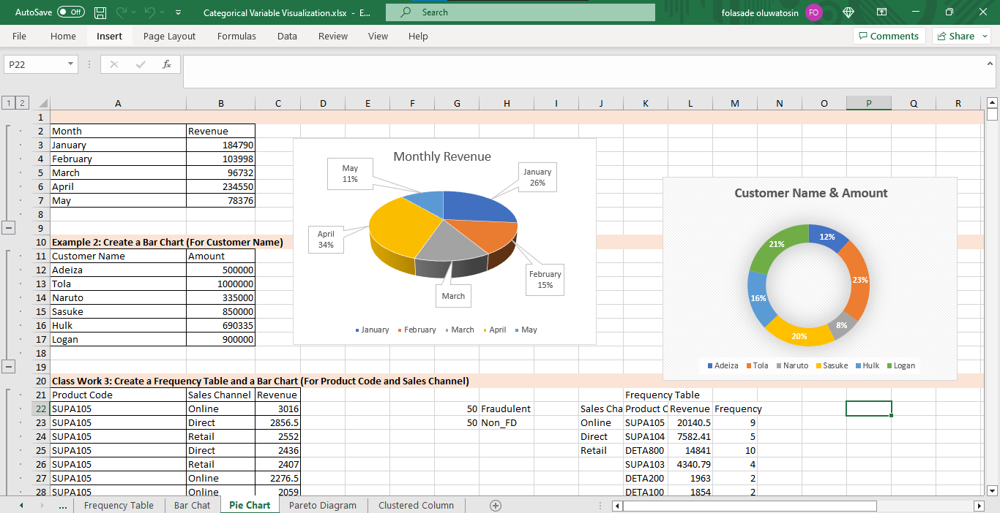
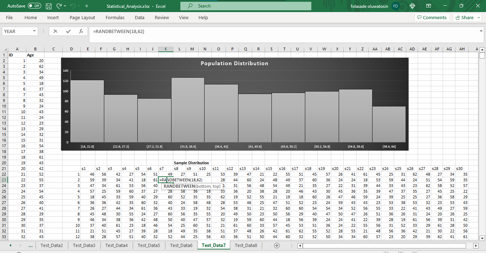
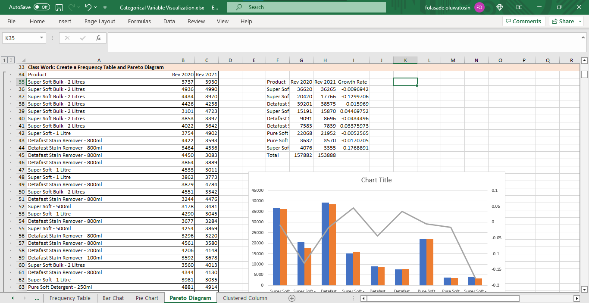
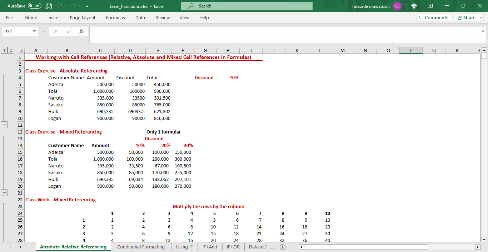

# Statistical_Analysis_Excel

## Using Microsoft Excel with Mathematics Skills and Statistics

#### Created Visuals with Excel(Pie Chart, Bar Chart, Histogram, Scatter Plot, Box Plot,.....), Used functions in Excel (Arithmetics, Conditional, Indexing, VlookUp,...), Cell Referencing,........

 
 
 
